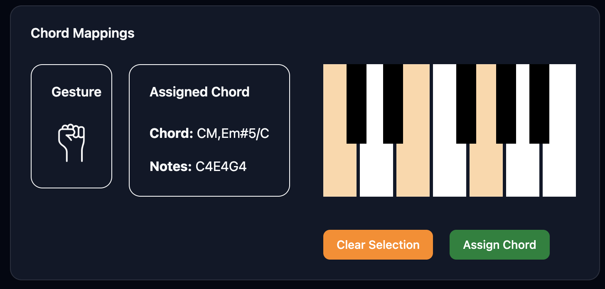

# HandSynth 🎹👋

**Real-time Hand Gesture Music Synthesizer**

HandSynth is an innovative music application that transforms hand gestures into musical chords using computer vision and deep learning. Point, peace, palm, or show three fingers to create beautiful music in real-time!



## ✨ Features

- **Real-time Gesture Recognition**: Uses a custom MobileNetV3-UNet model for fast hand keypoint detection
- **Musical Synthesis**: Convert gestures to MIDI notes or audio synthesis using Tone.js
- **Customizable Chord Mappings**: Map any gesture to your preferred chord combinations
- **MIDI Support**: Connect external MIDI devices for professional music production
- **Multiple I/O Options**: Support for multiple webcams and audio outputs
- **Responsive UI**: Modern React interface with real-time visual feedback

## 🎯 Supported Gestures

| Gesture | Default Chord | Description |
|---------|---------------|-------------|
| 🖐️ Palm | D4, F4, A4 | All five fingers extended |
| ✌️ Peace | E4, G4, B4 | Index and middle finger up |
| 👉 Point | F4, A4, C4 | Index finger extended |
| 🤟 Three Fingers | G4, B4, D4 | Index, middle, and ring finger up |
| ✊ Fist | (Release) | All fingers closed - stops current notes |

## 🏗️ Architecture

### Frontend (React + TypeScript)
- **Framework**: React 19 with TypeScript and Vite
- **UI Components**: Radix UI with Tailwind CSS
- **Audio**: Tone.js for web audio synthesis
- **Camera**: React-Webcam for video capture
- **Real-time Communication**: Socket.IO client

### Backend (Python + Flask)
- **Framework**: Flask with Flask-SocketIO
- **Computer Vision**: OpenCV + MediaPipe for hand detection
- **Deep Learning**: PyTorch with custom MobileNetV3-UNet model
- **Real-time Processing**: Socket.IO for WebSocket communication

### Model Architecture
- **Base**: MobileNetV3-Large backbone for efficient mobile inference
- **Head**: U-Net decoder for precise keypoint heatmap prediction
- **Output**: 21 hand keypoints (MediaPipe format)
- **Performance**: Optimized for real-time processing (~10 FPS)

## 🚀 Quick Start

### Prerequisites
- Node.js 18+ and npm
- Python 3.8+
- Webcam access
- (Optional) MIDI device

### Installation

1. **Clone the repository**
   ```bash
   git clone <repository-url>
   cd HandSynth
   ```

2. **Install client dependencies**
   ```bash
   cd hand-synth/hand-synth-client
   npm install
   ```

3. **Install server dependencies**
   ```bash
   cd ../server
   pip install flask flask-socketio opencv-python torch torchvision mediapipe pillow numpy
   ```

### Running the Application

1. **Start the Python server**
   ```bash
   cd hand-synth/server
   python app.py
   ```
   Server will start on `http://localhost:5000`

2. **Start the React client** (in a new terminal)
   ```bash
   cd hand-synth/hand-synth-client
   npm run dev
   ```
   Client will start on `http://localhost:5173`

3. **Open your browser** and navigate to `http://localhost:5173`

4. **Allow camera access** when prompted

## 🎮 Usage

### Basic Operation
1. **Camera Setup**: Ensure your webcam is working and you're visible in the camera feed
2. **Gesture Recognition**: Make hand gestures in front of the camera
3. **Audio Output**: Hear the corresponding chords play automatically
4. **Chord Mapping**: Use the interface to customize which chords play for each gesture

### Advanced Features

#### MIDI Integration
- Connect a MIDI device to your computer
- Enable MIDI output in the I/O Settings panel
- Select your preferred MIDI device from the dropdown
- Your gestures will now send MIDI notes to external devices/software

#### Custom Chord Mappings
- Click on the Chord Mappings panel
- Select a gesture from the dropdown
- Use the virtual piano to select notes for that gesture
- Changes apply immediately

#### I/O Settings
- **Webcam Selection**: Choose from available cameras
- **Audio Output**: Select preferred audio device
- **MIDI Output**: Configure MIDI device routing

## 🔧 Technical Details

### Model Training

#### Dataset & Preprocessing
- **Dataset**: FreiHAND v2 public dataset (130,240 images)
- **Split**: 70% training, 15% validation, 15% test
- **Input Resolution**: 128x128 pixels (resized from 224x224)
- **Normalization**: Custom dataset statistics
  - Mean: [0.3950, 0.4323, 0.2954]
  - Std: [0.1966, 0.1734, 0.1836]
- **Heatmap Generation**: 32x32 Gaussian-blurred ground truth heatmaps

#### Training Configuration
- **Framework**: PyTorch with TensorBoard logging
- **Batch Size**: 48
- **Optimizer**: AdamW (lr=1e-3, weight_decay=1e-4)
- **Loss Function**: MSE Loss on heatmap predictions
- **Scheduler**: ReduceLROnPlateau (factor=0.5, patience=3)
- **Early Stopping**: 5 epochs patience
- **Final Model**: Checkpoint from epoch 11 (`checkpoint_11_128.pth`)

#### Model Performance
- **Average Keypoint Error**: 3.7% of image size
- **Accuracy Threshold**: 5 pixels for 128x128 images
- **Inference Speed**: ~10 FPS real-time processing

### Gesture Classification
Hand gestures are classified using rule-based logic on detected keypoints:
```python
def detect_hand_gesture(keypoints):
    # Check finger positions relative to joints
    thumb = keypoints[4, 1] < keypoints[2, 1]
    index = keypoints[8, 1] < keypoints[6, 1]
    # ... classification logic
```

### Real-time Pipeline
1. **Capture**: Webcam frames at ~10 FPS
2. **Detection**: MediaPipe hand detection
3. **Keypoint Estimation**: Custom PyTorch model inference
4. **Classification**: Rule-based gesture recognition
5. **Audio**: Tone.js synthesis or MIDI output

## 📁 Project Structure

```
HandSynth/
├── hand-synth/
│   ├── hand-synth-client/          # React frontend
│   │   ├── src/
│   │   │   ├── components/         # UI components
│   │   │   │   ├── ui/            # Base UI components
│   │   │   │   └── chordmapping.tsx
│   │   │   ├── pages/             # Route pages
│   │   │   ├── lib/               # Types and utilities
│   │   │   └── hooks/             # Custom React hooks
│   │   ├── public/                # Static assets
│   │   └── package.json           # Dependencies
│   └── server/                     # Python backend
│       ├── app.py                 # Flask application
│       ├── model/                 # ML model files
│       │   ├── checkpoint_11_128.pth  # Trained model
│       │   ├── utils.py           # Model utilities
│       │   └── globals.py         # Model constants
│       └── sample_imgs/           # Sample images
```

## 🛠️ Development

### Client Development
```bash
cd hand-synth/hand-synth-client
npm run dev     # Development server
npm run build   # Production build
npm run lint    # Code linting
```

### Server Development
```bash
cd hand-synth/server
python app.py   # Run with debug=True for development
```

### Adding New Gestures
1. **Update the detection logic** in `server/app.py:detect_hand_gesture()`
2. **Add gesture images** to `hand-synth-client/public/`
3. **Update the UI components** in `src/components/ui/gestureselect.tsx`
4. **Add default mappings** in `src/pages/home.tsx`

## 🎵 Audio Technical Details

### Tone.js Synthesis
- **Synthesizer**: PolySynth with custom envelope
- **Effects Chain**: Chorus → Volume → Limiter
- **ADSR**: Attack: 1s, Decay: 0.2s, Sustain: 0.8, Release: 1s

### MIDI Output
- **Protocol**: Web MIDI API
- **Note On**: 0x90 (channel 1)
- **Note Off**: 0x80 (channel 1)
- **Velocity**: 127 (maximum)

## 🔍 Troubleshooting

### Common Issues

**Camera not working**
- Check browser permissions for camera access
- Try refreshing the page
- Ensure no other applications are using the camera

**No audio output**
- Check system audio levels
- Try different audio output device in settings
- Ensure browser audio is not muted

**Gestures not detected**
- Ensure good lighting conditions
- Keep hand visible and unobstructed
- Check that the Python server is running

**MIDI not working**
- Connect MIDI device before starting the application
- Check that your MIDI device is recognized by the system
- Try refreshing the page after connecting MIDI device

## 🤝 Contributing

We welcome contributions! Please feel free to submit issues and pull requests.

### Development Setup
1. Fork the repository
2. Create a feature branch
3. Make your changes
4. Test thoroughly
5. Submit a pull request

## 📄 License

This project is for educational and research purposes. Please respect all dependencies' licenses.

## 🙏 Acknowledgments

- **MediaPipe** for hand detection framework
- **Tone.js** for web audio synthesis
- **React** and **TypeScript** for the frontend framework
- **PyTorch** for deep learning capabilities
- **MobileNetV3** architecture for efficient mobile inference

---

**Built with ❤️ for music and technology enthusiasts**